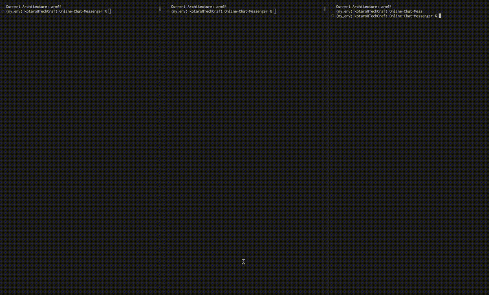

# Chat Messenger Messenger

## シミュレーション


## 目次
- [概要](#概要)
- [システムの全体構成](#システムの全体構成)
- [プロトコルのデータフォーマット](#プロトコルのデータフォーマット)
- [クラスの構成](#クラスの構成)
- [システムの流れ](#システムの流れ)
- [タイムアウト、退出、システム終了の詳細](#タイムアウト退出システム終了の詳細)
- [実行方法](#実行方法)
- [プロジェクトを通して](#プロジェクトを通して)
  - [苦労したこと](#苦労したこと)
  - [学んだこと](#学んだこと)
  - [こだわり](#こだわり)
  - [このプロジェクトを通じて得た成長](#このプロジェクトを通じて得た成長)
 
---

## **概要**
このプロジェクトは、**TCP/UDP通信を使用したシンプルなチャットメッセンジャーシステム**です。クライアントはTCP通信でチャットルームの作成や参加を行い、UDP通信を用いてメッセージの送受信を行います。また、一定時間非アクティブなクライアントを自動的に検出し、クリーンアップする機能も備えています。

## **システムの全体構成**

1. **クライアント**
    - ユーザーがルームの作成、参加、メッセージ送信を行うインターフェース。
    - TCP通信を使用してルーム情報の取得や認証、UDP通信を使用してチャットメッセージを送受信します。

2. **サーバー**
    - **TCPサーバー**: クライアントからのリクエストを受け取り、チャットルームの作成、参加、一覧取得の処理を行います。
    - **UDPサーバー**: チャットメッセージのリレーやクライアントの非アクティブ検出、クリーンアップを行います。

3. **データ構造**
    - **`rooms_info`**: 各チャットルームの情報（メンバーやパスワード）を保持します。
    - **`tokens_info`**: 各トークンのクライアント情報（接続先や最終アクセス時刻）を管理します。

## **プロトコルのデータフォーマット**

### TCPデータフォーマット
```json
{
  "operation": "1",                              // 1: ルーム作成, 2: ルーム参加
  "state": "0",                                  // 0: サーバの初期化, 1: リクエストの応答, 2: リクエストの完了
  "room_name": "roomA",                          // ルーム名
  "operation_payload": {
    "error_message": "error_message",            // エラーメッセージ（空の場合は正常）
    "type": "GET",                               // "GET": ルーム一覧の取得, "JOIN": ルームの参加
    "token": "token123",                         // クライアント用のトークン
    "password": "password123",                   // ルームのパスワード
    "room_list": "['roomA', 'roomB', 'roomC']"   // ルーム一覧
  }
}
```

### UDPデータフォーマット
```json
{
  "room_name": "roomA",            // ルーム名
  "token": "token123",             // クライアント用のトークン
  "content": {
    "type": "INITIAL",             // "INITIAL": チャット開始, "CHAT": 通常のチャット, "LEAVE": 退出, "CLOSE": ルームのクローズ
    "user_name": "user1",          // ユーザー名
    "chat_data": "error_message"   // チャットメッセージ
  }
}
```

## **クラスの構成**

### 1. `TCPProtocolHandler`
- TCP通信で使用するデータの作成と解析を行います。
- **主な機能**:
  - データ作成 (`make_tcp_data`): クライアントからサーバーへ送信するTCPデータをバイト形式で作成します。
  - データ解析 (`parse_data`): サーバーから受信したTCPデータをパースし、辞書形式に変換します。

### 2. `UDPProtocolHandler`
- UDP通信で使用するメッセージの作成と解析を行います。
- **主な機能**:
  - メッセージ作成 (`make_udp_data`): クライアントやサーバー間でやり取りするメッセージデータをバイト形式で作成します。
  - メッセージ解析 (`parse_message`): 受信したUDPメッセージを解析し、辞書形式に変換します。

### 3. `TCPClient`
- TCP通信を介してサーバーにリクエストを送信し、レスポンスを受信します。
- **主な機能**:
  - サーバー接続 (`connect`)
  - リクエスト送信 (`send_request`)
  - サーバー接続の解除 (`disconnect`)

### 4. `UDPClient`
- UDP通信を介してメッセージを送受信します。
- **主な機能**:
  - メッセージ送信 (`send_message`)
  - メッセージ受信 (`recieve_message`)
  - ソケットの解放 (`close`)

### 5. `ChatClient`
- ユーザーインターフェースを提供し、ルームの作成、参加、チャット開始などの操作を処理します。
- **主な機能**:
  - ユーザーインターフェース（`play`）
  - ルームの作成処理 (`create_room_request`)
  - ルーム一覧の取得処理 (`get_room_list_request`)
  - ルームへの参加処理 (`join_room_request`)
  - チャットインターフェース (`start_chat`)

### 6. `ChatServer`
- すべてのルームやクライアント情報の管理、リクエストの処理を行います。
- **主な機能**:
  - ルームの作成 (`create_room`)
  - ルーム一覧の取得 (`get_room_list`)
  - ルームへの参加 (`join_room`)
  - 非アクティブクライアントの検出 (`detect_unactive_address_list`)

### 7. `TCPServer`
- TCP通信を介してクライアントからのリクエストを受け取り、適切な処理を実行します。
- **主な機能**:
  - クライアントからの接続受付 (`run`)
  - リクエスト処理 (`handle_request`)

### 8. `UDPServer`
- UDP通信を介してメッセージを受信し、リレーまたは適切な処理を行います。
- **主な機能**:
  - クライアントからのメッセージ受信 (`run`)
  - メッセージの処理 (`handle_message`)
  - 非アクティブクライアントの削除 (`handle_unactive_client`)

## **システムの流れ**
1. **クライアント側**
- `ChatClient`でユーザーの要求を受信
- `TCP/UDPProtocolHandler`で送信データの作成
- `TCP/UDPClient`でデータの送信と受信
- `TCP/UDPProtocolHandler`で受信データの解析
- `ChatClient`でユーザーにデータ表示

2. **サーバー側**
- `TCP/UDPServer`でデータ受信
- `TCP/UDPProtocolHandler`でデータ解析
- 解析結果を基に`ChatServer`でデータ処理
- 処理結果を基に`TCP/UDPProtocolHandler`でデータ作成
- `TCP/UDPServer`でデータ送信

## **タイムアウト、退出、システム終了の詳細**
1. **タイムアウト**
- 各クライアントの最終アクセス時刻を監視し、一定時間（デフォルト15秒）を過ぎたら自動的に退出させます。
2. **退出**
- ルーム情報から削除されます。ルームに再度入出する場合は再度パスワードの入力が必要です。
- ホストが退出した場合は、ゲスト全員を自動的に退出させます。
3. **サーバー停止**
- チャットに参加しているクライアント全員を自動的に退出させます。
## **実行方法**

### システム要件
- OS: Linux（Ubuntu推奨）
- Python: 3.8異常
- パッケージ管理: apt

### パッケージ、ライブラリのインストール
1. 必要なOSパッケージをインストールします。
    ```bash
    sudo apt update
    sudo apt install python3-venv
2. 仮想環境を生成します。
    ```bash
    python3 -m venv my_env
    source my_env/bin/activate
3. 必要なライブラリをインストールします。
    ```bash
    pip install -r requirements.txt

### サーバーの起動
1. サーバーのスクリプトを実行します。
   ```bash
   python3 server.py
   ```

### クライアントの起動
1. クライアントのスクリプトを実行します。
   ```bash
   python3 client.py
   ```
2. ユーザーインターフェースに従って操作を行います。

## **プロジェクトを通して**

### **苦労したこと**
- スレッド処理の実装
  - 単一スレッドでの処理しか経験がなかったため、送信と受信を同時に行う方法がわからず苦戦した。
  - 複数スレッドを使えば解決できることを知り感動したが、スレッド間のデータ共有や適切な終了処理に苦労した。
  - スレッドが終了しない原因がデータ受信でのブロッキングにあると気づき、ブロッキング時間の設定を行うことで解決した。
- TCP通信の仕組み
  - TCPはストリーム型であるため、一度の受信で指定したバイトサイズのデータが取得できないことがあった。
  - そのため、ループで受信を行い、ヘッダーからボディサイズを取得する方式を導入して対処した。
- プログラムの強制終了時のエラー
  - スレッドが終了していないことが原因でエラーが発生することが多かった。
  - データ受信でブロッキングされることが要因だったため、適切なタイムアウト設定を行い、スムーズにスレッドを終了できるようにした。
- クラス設計
  - 最初はクラスの役割分担を明確にせずに実装してしまい、後で見返したときに自分でも理解しづらいコードになっていた。
  - クライアント側とサーバー側で共通の処理を適切に分割できておらず、重複したコードが増えてしまった。
  - 設計を見直し、責務ごとに適切なクラスを作成することで、コードの可読性と拡張性を向上させた。 

### **学んだこと**
- ネットワーク通信の仕組み
  - サーバーとクライアント間のデータのやり取りがどのように行われるかを深く理解できた。
  - ソケットプログラミングを通じて、TCP/UDP通信の違いや、それぞれのメリット・デメリットを体験的に学んだ。 
- スレッドと並行処理
  - スレッドを活用することで、送信と受信を並行処理できるようになった。
  - スレッド間でのデータ共有方法を学び、フラグを利用したスレッド間通信を実装した。 
- プロトコル設計
  - クライアントとサーバー間でのデータの送受信ルールを明確にすることで、シンプルで拡張性の高い通信が可能になった。
  - ヘッダーとボディの構造を分けることで、安定したデータ転送を実現した。 
- エラーハンドリング
  - 強制終了時のエラーを回避するために、スレッドの適切な終了処理を行う重要性を学んだ。
  - 通信のタイムアウトを実装することで、より実用的なシステム設計ができるようになった。

### **こだわり**
- 共通データフォーマットの設計
  - クライアントとサーバーの両方で利用できるデータ作成・解析クラスを作成し、コードの再利用性を向上させた。
  - メソッドのオーバーロードを活用し、必要な引数だけでメソッドを呼び出せるように設計した。 
- 可読性と拡張性の向上
  - クラスごとの責務を明確にし、役割ごとに分割することで、機能追加や保守がしやすい設計にした。
  - スレッドのライフサイクルを管理し、メモリリークが発生しないように工夫した。

 ### **このプロジェクトを通じて得た成長**
 - ネットワークやOSの理解が深まった
   - CS50やRecursion の学習を通じて、ネットワーク、OS、アルゴリズムについての理論的な知識を得ていたが、実際にプロジェクトを通して、それらの知識がどのように実用的に活用できるのかを体験できた。 
 - 開発を通じて「持続可能なコード」の重要性を実感
   - 「動くコード」ではなく「持続可能なコード」を意識するようになった。 
  
